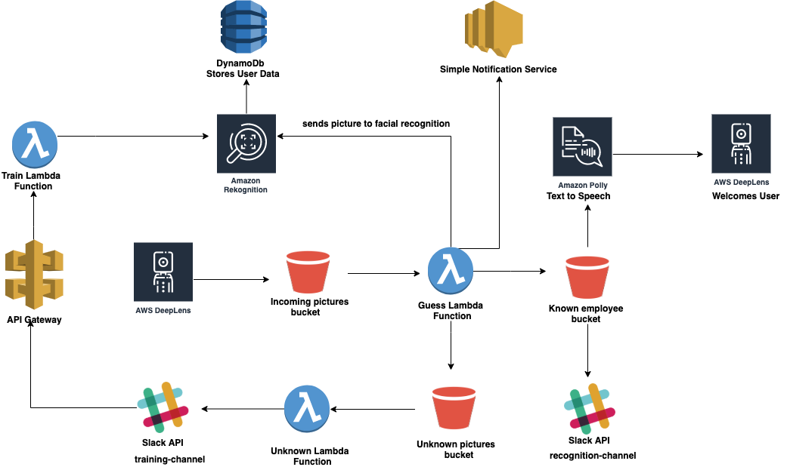

 # Concierge As A Service

This repository holds the source code for a serverless stack that uses AWS Native Services like AWS Rekognition, AWS Lambda, Simple Notification Service, DynamoDb, AWS SAM. Using AWS DeepLens, the detection of a person in the video stream triggers the whole process of recognising a person and handling occasions where the person captured is not a known person.

# Architecture Diagram

 

# What really happens here?

- When a person is detected by DeepLens, it uploads a picture of the person to an S3 bucket which triggers a lambda function that interacts with AWS Rekognition to identify the person in the picture.
- Upon recognising the person, a notification is sent to Slack with the picture of the person and DynamoDb is updated with the user details including emotional analysis.
- If the person is not recognised, the picture is still sent to Slack for admins to verify if the person is actually unknown. The admin can choose who the user is via Slack which triggers API Gateway to train AWS Rekognition on who the person is. If ignored, the photo will be deleted. Also everytime an unknown person is detected, details about the person like emotions and age-range are updated in DynamoDb database.
- A notification alert with the picture of the person is sent to the admins via phone and email when an unknown person is detected.

# Implementation Details

- GitHub branch based workflow. Branches named after features which eventually get merged into `master`.
- CodePipeline/CodeBuild for CI/CD process.
- Cloudformation for deploying technology stacks.
- AWS Lambda using python for development.

# Success or Failure?

- Success! Because this service has been implemented to use Artificial Intelligence and Machine Learning technologies which work perfectly!